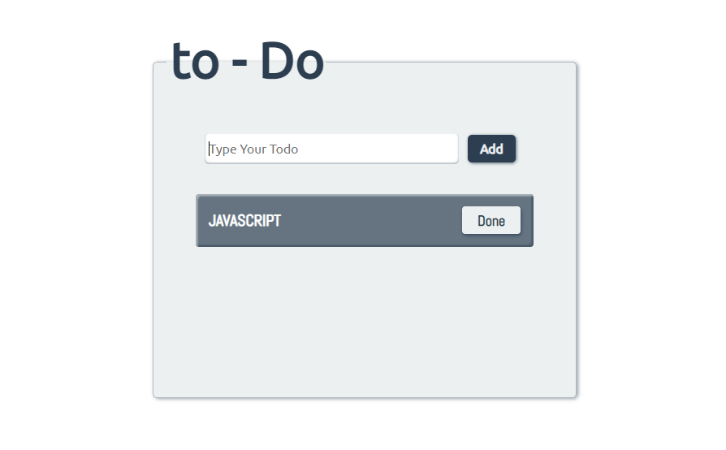

<style>
    H1 { color: #3498db }
    H2 { color: #aacbaa }
    STRONG { color: #2c3e50 }
    P { color: #ecf0f1 }
</style>

# To - Do App 📋



## Key covered in this project

* document
    * .getElementById()
    * .querySelector()
    * .createElement()
* .addEventListener()
* .trim()
* .value
* .style.height
* .innerHTML
* .toUpperCase()
* .classList.add()
* .focus()
* .appendChild()
* .target.parentNode
* .removeChild()

**To-Do App** is a simple project that allows you to add a task on the DOM, first of all, you have to write your task on the input text section, when you've finished your task, go to the **Add** button and pressing it and your task appear on the **UL** element, as a list, when the list is completed, you can delete it from the task.

This project helps you to know how we can manipulate the **DOM** white **JS**, adding or removing some HTML elements.

If you want to know how to manipulate the DOM (Document Object Model), go to [Mozilla Developer Network (MDN)](https://developer.mozilla.org/en-US/docs/Glossary/DOM) or go to [Wikipedia - DOM (Document Object Model)](https://en.wikipedia.org/wiki/Document_Object_Model).

I use three technologies for this purpose, [HTML](https://developer.mozilla.org/en-US/docs/Web/HTML), [CSS](https://developer.mozilla.org/en-US/docs/Web/CSS) and [JavaScript](https://developer.mozilla.org/en-US/docs/Web/JavaScript), but I used a preprocessor like [SASS](https://sass-lang.com) to write a **CSS** styles more effectively and easy to mantain, below here, you can see a snippet code of the project.

Also, in the project I decided to use an **IIFE** function to run immediately our code evoiding to wait a few milliseconds to execute the code.

## IIFE (Immediately Invoked Function Expression)

An IIFE, is a [JavaScript](https://developer.mozilla.org/en-US/docs/Web/JavaScript) function that help us to execute our code immediately after we've built or defined it, also called anonymous function. This function could include many function and global variables, but it's important to limit the uses of global variables if we want to avoid some problems on our code, this function is better than *function expression* or *function declaration*, if you don't need to reuse the code again. More information about how an IIFE function works, go to [Mozilla Developer Network (MDN)](https://developer.mozilla.org/en-US/docs/Glossary/IIFE).

## Snippet code

```js
(() => {
    function task() {
        const todo_text = document.getElementById('todo') // input element
        const submit_btn = document.getElementById('btn');
        const todo_task = document.querySelector('.to--do__task');

        submit_btn.addEventListener('click', createTodoTask );

        function createTodoTask() {
            // Add item on the task
            let taskItem = todo_text.value;

            // delete white spaces
            if( taskItem.trim() ) {
                // Create new elements
                const newItem = document.createElement('li');
                const removeBtn = document.createElement('button');
                const spanElement = document.createElement('span');

                // Add item on span 
                spanElement.innerHTML = taskItem.toUpperCase();

                removeBtn.classList.add('delete');
                removeBtn.innerHTML = 'done';

                // clear input element
                todo_text.value = '';

                // add node to the end of the specified list
                newItem.appendChild( spanElement );
                newItem.appendChild( removeBtn );

                todo_task.appendChild( newItem );

                // remove option for the new item
                removeBtn.addEventListener('click', removeItems )
            }
        }

        function removeItem() {
            // Create a parent node

            // remove child node from the parent node
        }

        createTodoTask()
    }

    task()
})()
```